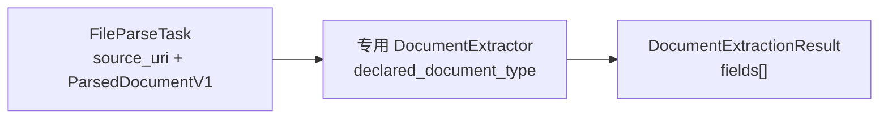
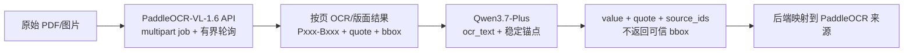

## Context

现有 `FileParseService` 已把 PDF/DOCX 转成 `ParsedDocumentV1` 并保存到 `file_parse_task.result_snapshot`。一期风控助手只需要从四类已知文件中提取固定字段，没有必要同时解决自动分类、通用 OCR/VLM 编排、多候选事实解析和单文档规则平台。

DOCX 输入默认是已接受修订的最终版。OCR/VLM 候选生产路线已收敛为 PaddleOCR-VL-1.6 API + Qwen3.7-Plus API：PaddleOCR 负责扫描件的版面解析、文字和位置，Qwen 负责语义理解和字段选择。正式启用前仍需用代表性样本验证准确率、位置回映、成本、配额和数据出网边界，并据此更新 ADR-016。

## Goals / Non-Goals

**Goals:**

- 用最短链路从单个 `file_parse_task` 得到版本化字段结果。
- 保持 `ParsedDocumentV1` 兼容，支持扫描 PDF、图片和普通 DOCX。
- 由用户声明文档类型，按类型运行四个独立 extractor。
- 只保留后续 LangGraph 真正需要的字段、状态和来源。
- 用单一 provider port 隔离 PaddleOCR/Qwen 组合实现，并保持领域层只调用一次 provider。
- 让 PaddleOCR 成为扫描件来源位置的唯一权威，避免两家服务的上传和图像预处理差异污染 bbox。

**Non-Goals:**

- 不自动分类文档，不建立页面路由或感知结果对象。
- 不保留 provider 原始响应、候选链、单文档事实解析过程或公式校验对象。
- 不处理 Word 修订历史。
- 不创建风险任务、LangGraph、人工复核、ERP 或前端。

## Decisions

### 1. 数据流压缩为“解析、抽取、返回”



只有 `FileParseTask/ParsedDocumentV1` 和 `DocumentExtractionResult` 跨模块传递。extractor 内部可以完成以下工作，但不把它们暴露成流程节点：

1. 判断使用解析文本还是原文件图像；
2. 调用选定的 OCR/VLM/文本模型 adapter；
3. 按专用 schema 读取字段；
4. 做最小值格式归一化；
5. 校验证据是否能回到 block、页码或原文 quote；
6. 组装 `ExtractedField`。

这样做牺牲中间过程的可编排性，但显著减少一期代码、状态和测试矩阵。后续只有在真实需求出现时，才把某个内部步骤提升为独立节点。

### 2. 只保留三个核心数据对象

| 对象 | 最小字段 | 用途 |
|---|---|---|
| `ParsedDocumentV1` | 既有 metadata、blocks、sections、warnings | 文件解析事实；继续存入 `file_parse_task.result_snapshot` |
| `ExtractedField` | field_code、raw_value、normalized_value、unit、status、sources、alternatives | 表示一个业务字段；sources 直接内嵌 block_id/page/quote/可选 bbox |
| `DocumentExtractionResult` | document_type、fields、warnings、parser_version、extractor_version、provider_version | 第一阶段唯一输出；第二阶段持久化和消费 |

`ExtractedField.status` 只允许：

- `FOUND`：存在一个可使用的值，并且至少有一条来源；
- `MISSING`：没有提取到值；
- `UNCERTAIN`：存在冲突、证据不足、低置信度或声明类型疑似错误。

`alternatives` 只是 `ExtractedField` 内的简单值列表，不引入 `FactCandidate`。来源也是内嵌小结构，不引入独立 `EvidenceRef` 领域对象。

### 3. 文档类型由用户声明

创建风险文件关联时必须提供：

```text
PURCHASE_CONTRACT | SALES_CONTRACT | APPROVAL_FORM | SETTLEMENT_STATEMENT
```

`DocumentExtractorRegistry` 直接按该枚举选择 extractor。模型不负责决定类型。extractor 可以对标题和关键角色词做廉价一致性检查；明显不符时输出 `DOCUMENT_TYPE_SUSPECTED` warning，并把相关字段标记为 `UNCERTAIN`，但不自动切换到另一 extractor。

这将删除分类器、公司主数据分类 Protocol、分类置信度和 UNKNOWN/NEEDS_REVIEW 状态。上传错误由内部用户在第二阶段人工复核解决。

### 4. 选用 PaddleOCR 主解析、Qwen 语义选择的组合 provider

`DocumentExtractionProvider` 只提供一个能力：

```text
extract(document_type, parsed_document, source_file, output_schema) -> structured fields
```

领域层只看到一个 `DocumentExtractionProvider`。候选 production 实现为 `PaddleOcrQwenDocumentExtractionProvider`，位于 `backend/app/integrations/document_extraction/`，内部使用两个异步 HTTP client，但不为它们建立领域端口、路由对象或 provider registry。

扫描 PDF/图片的内部流程：



普通 DOCX 已有可靠文本层，直接把 `ParsedDocumentV1` 文本和 block ID 交给 Qwen，跳过 PaddleOCR 和页面图片。

PaddleOCR 结果必须转换为稳定锚点，例如：

```text
[P001-B003] 合同数量：2000吨
[P001-B004] 含税单价：5350元/吨
```

Qwen 只返回 `value`、`quote` 和 `source_ids`。adapter 使用 `source_ids` 和 quote 把字段回映到 PaddleOCR 的 page/bbox；数值字段允许用 raw value 的归一化文本匹配作为 quote 格式变化的兜底。Qwen 返回的自报坐标不得进入 `ExtractedField.sources`。source ID 不存在、quote/raw value 均无法匹配或 OCR/Qwen 数值冲突时，字段进入 `UNCERTAIN`。

一期不向 Qwen 上传页面图片，因此不存在两套图像坐标对齐问题。若未来重新启用图文模式，仍不得采用 Qwen bbox；若开启 PaddleOCR 方向分类或图像矫正，必须获得可回到原始页面的变换信息。一期默认关闭这两项。

Qwen 每份文档最多调用一次，使用 JSON Mode、关闭思考模式并由 Pydantic 校验返回结构。JSON Mode 只保证合法 JSON，不被视为 schema 校验。OCR/Qwen 冲突不启动 ReAct 或递归模型调用。

选型采用轻量 spike：

1. 用 PaddleOCR-VL-1.6 API 解析采购合同、销售合同和结算单，验证页序、表格数字、稳定锚点和 bbox；审批表继续走 DOCX 原生解析；
2. 用 Qwen3.7-Plus 比较 `ocr_text` 与 `image_and_ocr` 两种输入模式；实测准确率相同，图文模式 Token 约 2.90 倍、时延约 1.76 倍且来源回映更差，因此 production 固定 `ocr_text`；
3. 记录字段正确率、来源可定位率、耗时、成本、API 配额、结果 URL 生命周期和两家云平台的数据边界；
4. 在 `docs/risk-assistant/document-ai-spike.md` 写结论并更新 ADR-016；
5. ADR 确认后只实现一个 production 组合 adapter。

接入使用现有异步 `httpx`，不增加 `requests`。PaddleOCR 使用 multipart 上传原文件，不传外部可访问的 MinIO URL；Qwen 一期只接收带锚点文本。所有轮询必须有总超时、退避和终态检查；provider 返回的 JSONL URL 必须经过 HTTPS 和主机白名单校验。任何真实模型调用由第二阶段风险任务 handler 创建或更新 `agent_invocation_record`，`FileParseService` 不触发模型。

### 5. 四个 extractor 独立，但共享结果结构

四个 extractor 只隔离 output schema、prompt 和字段白名单：

- PurchaseContractExtractor：上游供应商、合同号、日期、货物、数量、单价、金额、优惠、保证金；
- SalesContractExtractor：下游客户、合同号、日期、交货地点、数量、单价、金额；
- ApprovalFormExtractor：业务模式原文、上游/下游原文和审批表量化字段；
- SettlementStatementExtractor：浮动费、占用天数、结算数量/金额和补款。

每个 extractor 最多调用一次 provider。字段缺失返回 `MISSING`；多个冲突值或缺少来源返回 `UNCERTAIN`。一期不做数量×单价等公式校验，这些规则统一留给第二阶段。

### 6. 解析结果和抽取结果保持分离

`file_parse_task.result_snapshot` 继续只保存 `ParsedDocumentV1`。第一阶段不新增抽取结果表；`DocumentExtractionResult` 由第二阶段保存到 `RiskAssessmentDocument.extraction_snapshot`。

扫描 PDF 或图片的 `ParsedDocumentV1` 可以只有少量/空 blocks 和明确 warning。extractor 同时获得 `source_uri`，由选定 provider adapter 在需要时读取原文件，不要求 FileReader 提前生成页面图像对象。

## Risks / Trade-offs

- [用户声明错文档类型] → extractor 做廉价一致性检查并输出 UNCERTAIN，第二阶段允许人工改正。
- [只保存一个字段结果会损失完整候选链] → UNCERTAIN 可携带简单 alternatives；一期不保存模型推理过程。
- [provider 内部逻辑不透明] → 保留字段来源、provider/extractor 版本和调用审计，不为可观测性提前建设编排层。
- [未来图文模式引入第二套页面像素] → 一期 production 固定 `ocr_text`；未来即使启用图片也不使用 Qwen bbox。
- [两家云平台产生双重数据出网] → 增加默认关闭的显式 cloud-egress 开关；实际调用由风险任务 handler 校验 Agent visibility、调用主体和权限，未完成审批时 fail closed，不使用全局 deployment profile 代替资源授权。
- [PaddleOCR 异步任务或结果 URL 不稳定] → 限制文件大小/页数、轮询总时长和响应大小，校验结果 URL 主机，不持久化签名 URL。
- [Qwen JSON 合法但字段不符合 schema] → 关闭思考模式，使用 JSON Mode 后仍执行 Pydantic、字段白名单和来源校验。
- [未来需要多 provider 路由] → 在出现成本、可用性或准确率的真实需求后再扩展 port，不在一期预留 registry。
- [非修订 DOCX 假设被违反] → 上传规范要求接受修订后的最终版，修订解析另立 change。

## Migration Plan

1. 为扫描 PDF 增加低文本 warning，为 PNG/JPG 增加最小 ImageReader；保持 ParsedDocument 顶层不变。
2. 修复普通 DOCX 合并单元格重复。
3. 定义 `ExtractedField`、`DocumentExtractionResult` 和单一 provider port。
4. 增加 PaddleOCR/Qwen 独立配置和默认关闭的数据出网开关；配置加载与全局 deployment profile 解耦。
5. 完成 PaddleOCR + Qwen 两种输入模式的轻量 spike，更新验证记录和 ADR。
6. ADR 确认后实现两个异步 client 和一个组合 provider adapter，补齐 source ID/quote 到 PaddleOCR bbox 的回映测试。
7. 第二阶段 LangGraph 调用该 service 并持久化结果。

回滚时关闭 selected provider 配置；既有 PDF/DOCX 文件解析和合同审查不受影响。

## Open Questions

- PaddleOCR AI Studio 与阿里云百炼的生产配额、并发限制、日志/文件留存及删除机制。
- 原始合同上传 PaddleOCR、页面图片/OCR 文本上传百炼的数据出网审批结果。
